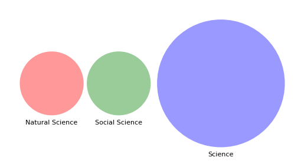
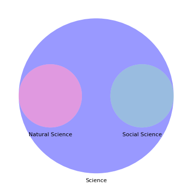
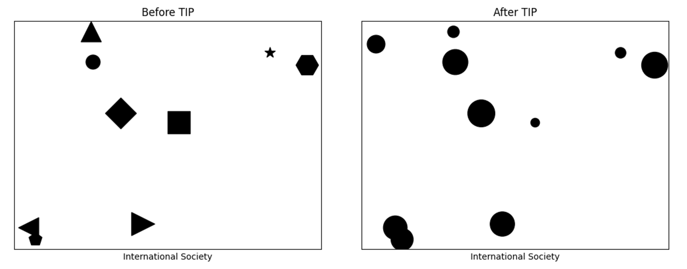

最近几年我遇到了一些有志于国际关系专业（[International Relations: IR](https://en.wikipedia.org/wiki/International_relations)）但缺乏专业意识的同学，他们普遍误解IR属于文科。我一直想写一篇严肃文章介绍IR，但总觉得通过聚焦*“什么是IR”*这个问题来诠释其专业性是隔靴搔痒，不得要害，所以迟迟没有动笔。直到前些日子看到B站上出现了很多**伪**”社会科学概论“课程，我才终于意识到大多数同学的问题在于对IR这门学科的科学属性及其背后的学科分类的不了解。因此，本文旨在通过阐明科学（Science）、社会科学（Social Science）、自然科学（Natural Science）之间关系，明确**科学学科**与**人文学科**的界限，帮助读者提升对IR这门**社会科学**`学科` 的专业意识。

首先要明确的是，科学无论在哪个国家都是小众的、难以普及的，因为知识传播的阻力是巨大的，光谱的另一极则是我们熟悉的谣言；其次，对于中国人来说，科学这个词可谓是“魂牵梦绕“，距离陈独秀1919年在《新青年》上首次提及”赛先生”已经过去了100多年，然终不能解，这多少让人觉得有些无奈。

> 但是追本溯源，本誌同人本來無罪，只因為擁護那德莫克拉西（Democracy）和**賽因斯（Science）**兩位先生，才犯了這幾條滔天的大罪。·······要擁護那賽先生，便不得不反對舊藝術、舊宗教。
>
> ​							—— [陳獨秀 《新青年》罪案之答辯書](https://zh.wikisource.org/zh/《新青年》罪案之答辩书)

科学究竟是什么？简而言之，科学是用来研究**客观世界**的方法论，它通过观察、实验、推理和验证来获取客观真理和知识。进一步，科学主要包括自然科学（**Natural science**）和社会科学（**Social science**）两个分支：

- 自然科学主要研究自然界及其自然现象，试图揭示自然现象的**客观规律**。如：物理学，化学，天文学。
- 社会科学主要研究人类社会及其社会现象，试图揭示社会现象的**客观规律**。如：政治学，心理学，经济学。

自然科学、社会科学和科学的集合关系是：

> **自然科学∪社会科学 ⊂ 科学**

人们通常不会怀疑自然科学的使命，而对社会科学是否能够实现其使命存在疑虑。这主要是因为人类行为和社会现象具有一定的主观性。但这实际上并不妨碍社会科学**通过建立理论框架来控制主观因素**，从而达到识别和解释社会客观规律的目的（虽然还是有很多自然科学家看不上社会科学家，没办法，谁让社会科学向自然科学学习的情况更为普遍呢？）。

那么，IR这门学科的定位在哪里呢？答案是社会科学。至少，在肯尼斯·沃尔兹（[Kenneth Neal Waltz](https://en.wikipedia.org/wiki/Kenneth_Waltz)）于1979年出版那本著名的《[Theory of International Politics](https://en.wikipedia.org/wiki/Theory_of_International_Politics)》（TIP）后，IR逐渐完成了科学化并成为社会科学的一部分。在TIP中，沃尔兹提出的结构现实主义理论框架通过将国家抽象为**功能一致的单位**，强调了国际体系结构对国家行为的决定性作用，从而削减了对国家领导人、国家社会制度等主观因素的关注。因此，TIP在很大程度上减少了主观因素对国际关系研究的影响，建立了国际关系理论框架，使国际关系理论走向客观化和科学化。

在明确IR及其社会科学的定位后，我们再来审视人文学科。中文语境中常见的不是自然科学和社会科学的并列，而是“人文社会科学”、“人文社科”等表述——显然，人文被同社会科学并列，暗示了人文学科也属于科学范畴。然而，在学术领域，人文（Humanities）特指专注于研究人类文化、价值观、宗教、艺术等方面的知识和理论。人文学科包括文学、历史学、哲学、宗教学等，都带有主观色彩，对它们的研究往往强调研究者对人类文化和思想的理解和解释。人们常说“一千个人心中有一千个哈姆雷特”、“历史是任人打扮的小姑娘”、“谁控制过去，谁就能控制将来”，本质上就是因为文学和历史学都是人文学科，对他们的解读很大程度依赖于人们的**主观感受**。相反，在非高速运动和非微观情况下，无论由谁来解释牛顿力学，都不会有差异，因为牛顿力学揭示的是客观世界的运行规律，不以人的意志为转移。

综上所述，**人文学科具有主观性，应该明确区分于强调客观性的科学学科。**人文学科指的是特定的学科领域划分，与科学无直接关系。本文认为人文学科不应被归入科学范畴，故反对使用含混表述如“人文科学”、’“人文社会科学”、“人文社科”。这样的不当表述经过长时间的语言重复和实践可能会混淆人们对社会科学学科的理解，误解IR是文科的现象就是其中一例。

最后，如文章开头所述，本文旨在**明确科学学科和人文学科的界限**，让读者对“社会科学”有一个基本的认识，所以文中对社会科学和人文学科的粗暴区分必然有其自身的局限性。例如，科学是否可以被视为是人文中理性的部分？要知道是人类通过理性发明了科学，没有人类自然就没有科学，那么科学是不是人文呢？又如，IR实际上是融合了历史学、政治学、经济学、军事学等一系列人文学科和社会科学知识（甚至大有直接融合自然科学之势，见 Alexander Wendt的*《[Quantum Mind and Social Science: Unifying Physical and Social Ontology](https://www.cambridge.org/core/books/quantum-mind-and-social-science/3D5DB273B648D0A23B49C1C4ABA5CF7A)》*）的交叉学科（Interdisciplinarity），本文为了突出IR的科学属性将其人文属性都忽略掉了。再如，其实自然科学和社会科学也存在着交叉和重叠……
