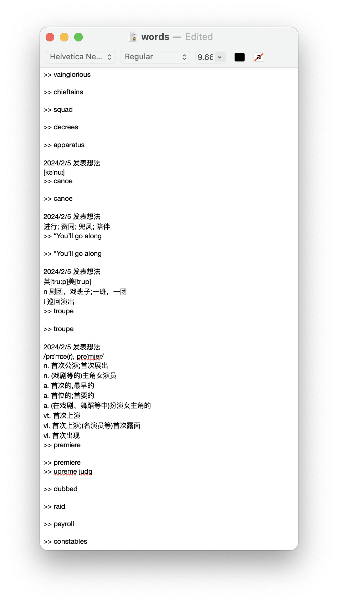

I have been using [Python](https://www.python.org) for a while and have recently come to realize how useful it is. This blog is intended to preserver codes I've created for my personal use.

I enjoy reading books in English on [Wechat Reading (WR)](https://weread.qq.com), though I am not much into Wechat itself. In recent years, WR has increasingly equipped itself with functions assisting readers in engaging with English books such as notes, lookup, auto-translation and pronunciation, etc. Among these, taking notes is as crucial as looking up for me. I have, therefore, underlined tons of English vocab while writing down notes. 

However, whenever I want to extract the vocab from my notes on WR, the thing bothered me lot was that WR exports all underlined vocab and its notes where I left notes both in English and Chinese. **How can I pull out the vocab without any Chinese characters and duplicates?**



My solution is to use [Regular Expressions (Regex)](https://en.wikipedia.org/wiki/Regular_expression). Let me start by writing a basic structure:

```
import re

text = '''....'''
pttn = r'...'
re.findall(pttn, text)
```

I found the extracted list is a list with the vocab preceded by  `>> ` and that most of the vocab I marked has more than 5 characters. Then I defined the pattern as follows:

```
pttn = r'>> (\w{5,})'
```

I used `\w` here instead of `\b[a-zA-Z]\b` because there are no `0-9` in English words. On top of this,  I limited the number of characters to a minimum of `5` to exclude articles (e.g., *a, the*), prepositions (e.g., *from, in, with*), and pronouns (e.g., *I, you, he, she*). Finally, I put `\w{5,}` in `( )`. This way, the captured words will not be prefixed with `>> `. Take a look at [>> (\w{5,})](https://regexper.com/#'%3E%3E%20%28%5Cw%7B5%2C%7D%29'). Looks good.

Sequentially, I found all matches and removed duplicates by converting the `list` to a `set`:

```
ls = set(re.findall(pttn, text))
```

To facilitate reading, let me print it out:

```
for word in ls:
  print(word)
```

Lastly, put the list in `text` and run the test:

```
import re

text = '''
>> vainglorious

>> chieftains

>> squad

>> decrees

>> apparatus

2024/2/5 发表想法
[kəˈnuː]
>> canoe

>> canoe

2024/2/5 发表想法
进行; 赞同; 兜风; 陪伴
>> “You’ll go along

>> “You’ll go along

2024/2/5 发表想法
英[tru:p]美[trup]
n 剧团，戏班子;一班，一团
i 巡回演出
>> troupe

>> troupe

2024/2/5 发表想法
/prɪˈmɪə(r), prəˈmjer/
n. 首次公演;首次展出
n. (戏剧等的)主角女演员
a. 首次的,最早的
a. 首位的;首要的
a. (在戏剧、舞蹈等中)扮演女主角的
vt. 首次上演
vi. 首次上演;(名演员等)首次露面
vi. 首次出现
>> premiere

>> premiere
>> upreme judg

>> dubbed

>> raid

>> payroll

>> constables

'''

pttn = r'>> (\w{5,})'
ls = set(re.findall(pttn, text))
for word in ls:
  print(word)
```

```
upreme
payroll
troupe
premiere
decrees
squad
canoe
dubbed
constables
vainglorious
chieftains
apparatus
```

This is exactly what I want! Let me wrap up by writing the above into a function named `capture_words`:

```
def capture_words(text):
    pattern = r'>> (\w{5,})'
    ls = set(re.findall(pttn, text))
    for word in ls:
      print(word)
```

```
capture_words('''>> hahahah        >> testtttt     ''')      # test
```

```
hahahah
testtttt
```

However, the function is not a perfect solution pulling out the vocab, as there are some words (less than 5 characters) missed such as *raid* . I will keep tweaking the code for a more comprehensive solution.
