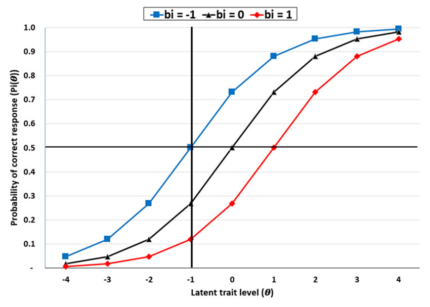
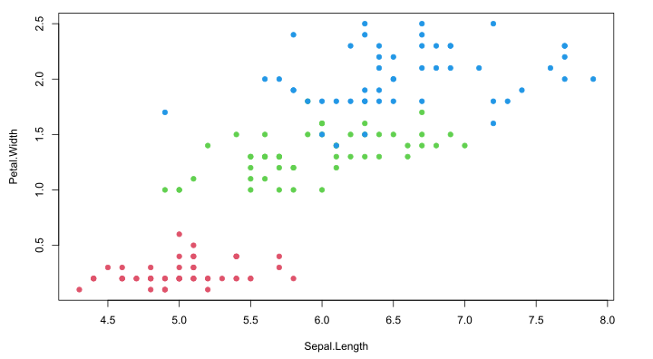

<figure>

<figcaption aria-hidden="true">Alt text renders to <em>image
caption</em>. Markdown formatting is available.</figcaption>
</figure>

## TeXtLite Features

- Math support through KaTeX
- Post tags & subtitle
- Hover footnotes[^1] through
  [tippy.js](https://atomiks.github.io/tippyjs/)
- Auto Floating TOC through [Tocbot](https://tscanlin.github.io/tocbot/)
- Hugo native features
  - Hugo version: `v0.93.0`
  - Syntax highlighting
  - [Mermaid / GoAt diagrams](https://gohugo.io/content-management/diagrams/)
- Comment systems
  - [utterances](https://utteranc.es)
  - [disqus](https://disqus.com)

### Math

$$
\begin{align}
\tag{1.1} Y_i &\sim Normal(\mu_i, \sigma) \\\\
\tag{1.2} \mu_i &= \alpha + \beta x_i
\end{align}
$$

### Diagram with GoAt

``` goat
                              .-.         
       R           |         | P |---->  R 
                   |          '-'         
     ^   ^         |         ^   ^        
    /     \        |        /     \       
 .-+       +-.     |     .-+       +-.    
| A |     | D |    |    | A |     | D |   
 '-'       '-'           '-'       '-'    
```

- [Origin](https://casual-effects.com/markdeep/)
- [Go re-implementation](https://github.com/blampe/goat)
- [Live editor](https://yongfu.name/dag/)

## Quarto Integration

### Dynamic R Code

``` r
head(iris)
```

    # A tibble: 6 × 5
      Sepal.Length Sepal.Width Petal.Length Petal.Width Species
             <dbl>       <dbl>        <dbl>       <dbl> <fct>  
    1          5.1         3.5          1.4         0.2 setosa 
    2          4.9         3            1.4         0.2 setosa 
    3          4.7         3.2          1.3         0.2 setosa 
    4          4.6         3.1          1.5         0.2 setosa 
    5          5           3.6          1.4         0.2 setosa 
    6          5.4         3.9          1.7         0.4 setosa 

``` r
# Set plot margins  # (b, l, t, r)
par(oma=c(0,0,0,0))  # Outer margin
par(mar=c(4.5, 4.5, 1, 3) )  # margin

with(iris, {
   plot(Sepal.Length, Petal.Width, pch=19, 
        col=c(setosa=2, versicolor=3, virginica=4)[Species] )
})
```



[^1]: A hover footnote.
