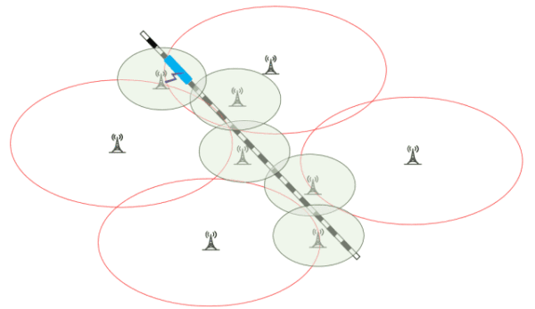

自学生时代起，我对通勤时间一直很敏感。在几段需要租房的求学经历中，我无一例外选择了离学校近的公寓。当时也没想那么多，只是单纯因为懒得来回折腾。工作后，这一习惯也延续了下来。

不过，我注意到身边的同事，尤其是年轻同事，似乎并不在意通勤时间的长短。他们在选择通勤方式时，倾向于优先考虑经济成本，因此选择了距离工作地较远的住所或效率较低的交通工具。起初我对此并无过多的想法，认为通勤时长不过是个人选择，只要愿意挤出时间，一切都可以通过加班或早出门来弥补。

然而，随着时间推移，我渐渐觉察到，每天通勤超过一个小时的同事似乎更容易陷入一种状态：他们很难安定下来做点事情。好不容易到了办公室，坐下不到10分钟就起身离开，5分钟后回来，再过20分钟又去找隔壁同事聊几句，然后再回来玩一会手机。如此往复，不知不觉一上午就过去了。即便他们中午愿意延长工作时间，产出往往也难以达到预期。

我们知道：

$$
\begin{align}
\text{工作产出} \ (Output) = \text{时间投入} \ (Time) × \text{效率} \ (E)
\end{align}
$$

当（加班后）时间T保持恒定，产出O减少时，说明效率E下降了：

$$
\begin{align}
O_\downarrow = T * E_\downarrow
\end{align}
$$

由此可见，以经济成本为优先考量选择长时间通勤的方案，带来的影响不仅是时间成本的增加，还有工作效率的牺牲。可是，长时间通勤为什么会导致工作效率降低？

我们知道，专注力是高效工作的基础。无论技能水平高低、工具优劣或外部环境如何，如果缺乏专注力，任何人都难以充分发挥能力完成任务。而专注力又是由精力（Mental energy）状态决定的。**精力决定一个人能专注多久，就像体力决定一个人能跑多久**。跑步时，无论技术多么高超、装备多么先进，体力是决定你能跑多远、跑多快的关键。如果体力耗尽，哪怕双腿依然强壮，也无法继续奔跑。同样，精力是专注的基础，一旦精力状态不佳，工作效率必然会有所下降。另外，体力的恢复相对简单——吃点零食、喝杯咖啡或许就能缓解。但精力的恢复往往需要深度修复，比如足够的睡眠或一段真正放松的时间，甚至是冥想。

然而，**长时间通勤正是我们精力的隐形杀手**。面对通勤过程中持续的外界刺激，我们需要不断消耗精力对其进行或主动或被动的“处理”。从人们常说的五感来看：交通工具的噪音和嘈杂的通勤环境刺激听觉；各路人马和看不完的热闹刺激视觉；食物的味道和乘客的体味刺激嗅觉；拥挤的车厢刺激触觉。不要以为味觉没事，气味是可以通过味觉系统间接接收的……然而，人体的感知能力远不止五感，还有**平衡感**[^1] 、**本体感**[^2]、**温觉**[^3]等等。这些刺激使身体接收和处理外界信息的“开关”始终处于强制开启的同时，还造成了注意力频繁切换的状态，进一步加剧了精力的消耗。这就像我们在高铁上开着蜂窝数据使用手机，发现电量消耗得特别快一样。因为，随着高铁的行进，手机需要频繁搜索并接收不同信号塔的信号，每次切换都需要消耗额外电量。同样，通勤中的我们，感官系统不得不持续接收并处理来自周围环境的不同刺激，就像手机不停切换信号一样，注意力被反复调用，次数越多，时间越久，精力消耗得越快。

**人的精力是有限的，如果在通勤中被过度消耗，工作时自然难以专注，效率也随之下降**。这几年流行的心流理论（Flow）将这种现象称为精神熵（Psychic entropy）的增加。因此，长时间通勤的代价远不止每天多花的时间——它对精力的损耗，可能对工作效率产生系统性影响。

了解这一点后，结论就显而易见了：**为了节省精力，提高工作效率，我们应尽量缩短通勤时间**[^4]。选择一个离公司近的住所是最直接有效的办法。但肯定有人会说，“我很想缩短通勤时长，住得近一些，可是靠近公司的房租很贵，我难以承担，怎么办？” 

短期来看，如果实在无法缩短通勤时间，一个比较好的办法就是对症下药——尽量屏蔽通勤中的感觉刺激。比如，我们可以闭上眼睛、戴上降噪耳机，收听喜欢的播客或有声书。这样能够有效减少视觉和各种声音的干扰，避免注意力频繁切换的同时，还能利用通勤时间学习一些有用的知识；长期来看，颇为沮丧地说，似乎没有什么办法。因为这始终是时间、精力、金钱之间的权衡。关键在于，我们永远应该清楚要选哪一个，并且，在时机成熟时，毅然做出选择。

最后，影响工作效率的因素很多，缩短通勤时间并不能保证工作效率的提高。缩短通勤时间是提升工作效率的一种**重要手段**，但很难说是必要条件，更不是充分条件.....

[^1]: 由内耳控制，帮助人保持身体平衡。
[^2]: Proprioception，感知自己身体各部位的位置和运动。
[^3]: Thermoception，感知温度的变化。

[^4]: 至于缩短到多久合适，答案只能是因人而异…… 
[^0]: 这里的效率（E）不仅仅指体力劳动的效率，更是大脑处理信息、完成复杂任务的能力。 

